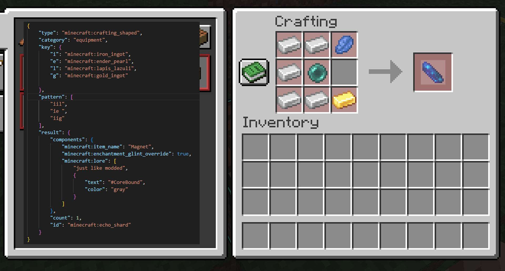
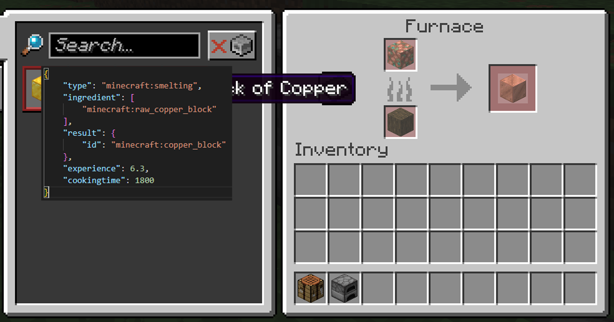
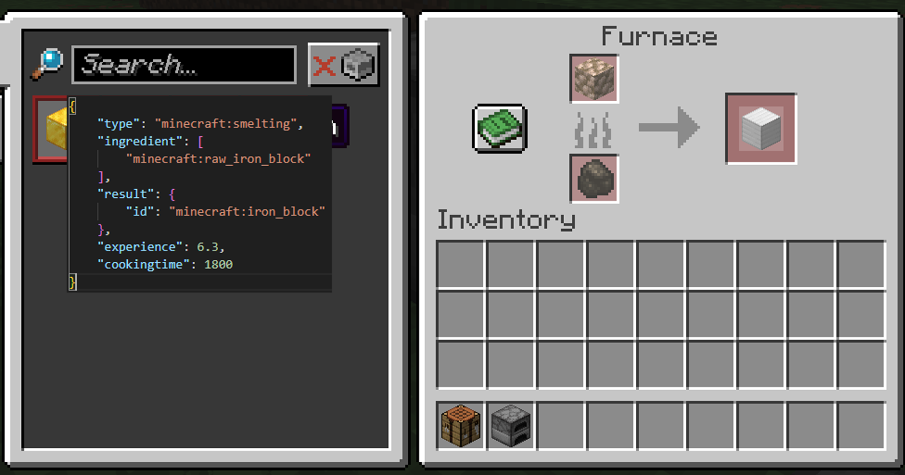
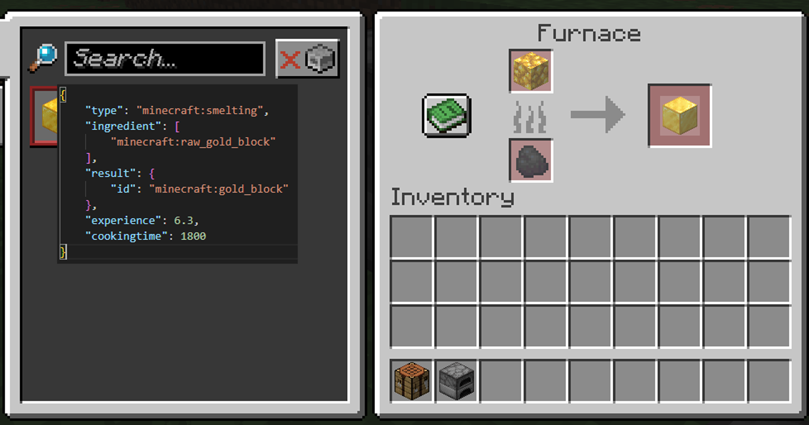
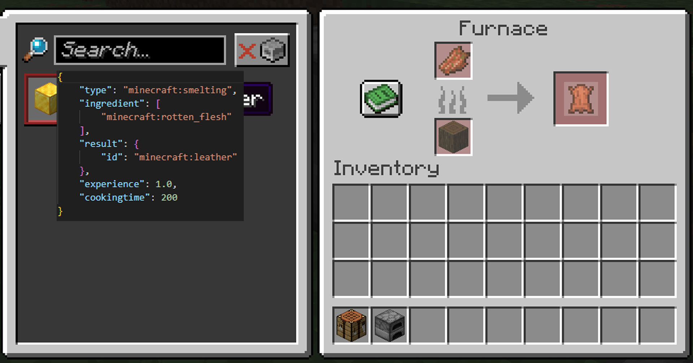
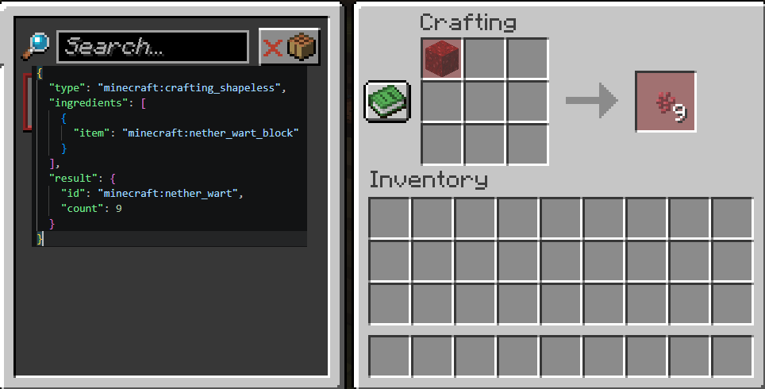

# CoreBound
A vanilla Minecraft server built from 1.21.9 - The Copper Age with datapacks, custom systems, and server-wide effects.

## Features
- Corebound Advancements: 
    new features added to advancements so that you can see what Corebound module has loaded and what it adds.

- Corebound System:
    Its primary purpose is to provide a common framework for:
    - Minecraft version detection
    - First-join player initialization
    - Shared storage values
    - Global setup routines
    - Datapack compatibility management
    - Common uninstall procedures

- Corebound Set Items:
    - Items now belong to sets. More items equiped from the set the more effects are active.
    - effects refresh every 10 seconds
        - Newbie Set (Leather Armour): 
            - 1/4: Luck 1 
            - 2/4: Speed 1 
            - 3/4: Regeneration 1 
            - 4/4: Resistance 1

- Corebound Magnet: 

    - uses a custom named echo shard named "Magnet" 
    - pulls dropped items and experience orbs

- Corebound Quality: 
    - tools and armour now have Quality Tiers
        - Uncommon
        - Rare
        - Epic
        - Legendary
    - search for "#CoreBound" in the recipe book

- Corebound Smelting: 

    - added block of raw copper, block of raw iron, block of raw gold smelting into their block versions.
        - cook time is 9 time longer that raw pieces - 30 seconds cook time.
    - added rotten flesh to leather, furnace only

- Corebound Crafting:

    - added unpacking recipe for netherwart from netherwart block

- Corebound Spectator Night Vision:
    - by default player in spectator mode can not see dark areas. this module grants spectators nightvision

- Corebound Custom Dimensions:
    - Spawn island
    - Altar island
    - Skyblock like player homes. /trigger sbhome

- Corebound Respawn Buff:
    - when a player gets killed, they recive 10 seconds of buffs to regain

- Leaderboards:
    - Vibe leaderboard in chat and at spawn via text_display

- Stat book:
    - allows players to see what their attributes are

- Player Auras:
    - beacon effects on a player
    - buffs other players but not you. other players buff you.

- Resets of Overworld, Nether, and End
- Contribution Altar

- Currently uses several VanillaTweaks datapacks but will be replacing those with Corebound speficic funtions.
    - the VanillaTweaks datapacks are: 
        - BACK
        - GRAVES
        - HOMES
        - SPAWN
        - TIMBER
        - TPA

## How to Play
1. Join the server: `play.corebound.xyz` *(example)*
2. Claim your home island
3. Explore reset zones for resources
4. Unlock & upgrade custom systems
5. Contribute to CoreBound's evolution

## Development Notes
AI tools were used for brainstorming, documentation help, and exploring possible function logic.
All datapack functions, systems, and implementations were manually tested and reviewed.

## Resources
https://vanillatweaks.net/

https://www.gamergeeks.net/apps/minecraft

https://misode.github.io/

https://chatgpt.com/

